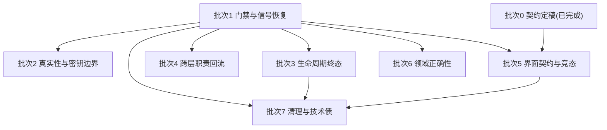

# 修复批次执行总纲

> 定稿：2026-08-16。基线：`main`，Android `versionName=0.1.12` / `versionCode=20`。
>
> 本文是 2026-08-16 全项目审查结论转为 GitHub Issue 后的执行入口。问题的完整描述在 Issue 里，不在本文重复；本文只回答「按什么顺序做、谁改什么、怎么验证、怎么交付」。

## 任务契约

### 目标

把 [2026-08-16 全项目审查报告](../审查/2026-08-16-全项目审查报告.md)登记的问题，按 8 个批次分次修完，每批次交付一个可审查的 PR。用户可感知的结果：界面不再出现永久「等待中」、切换项目不残留旧进度、抖音图文帖可以采集、失败不再破坏已有产物、密钥与签名参数不再落盘。

### 允许修改

按批次限定，见下方「批次与归属」表。跨出该批次归属目录的改动需要先说明理由。

### 明确不做

- 不新增云端后端、登录、同步、数据库或后台服务。
- 不为了绕过问题而放宽权限、TLS 校验或安全检查。
- 不构建、不交付、不归档 Debug APK。
- 不推进 `versionName` / `versionCode`，除非该批次确实要发布。
- 不在本轮引入新功能；本轮全部是修复、清理与契约对齐。

### 权威状态与数据

关键 ID 是 `taskId`、`sessionId`、`projectId`。每个 ID 的权威状态源见 [架构与工程规范](../架构与工程规范.md)。批次 3 与批次 5 会直接触碰这些 ID 的写入路径，改动前必须确认没有引入第二个写入方。

### 验收

见每个 sub-issue 正文的「验收标准」，以及下方「验证映射」。

## 批次与归属

| 批次 | Parent | Sub-issues | 架构归属 | 允许修改的主要目录 |
| --- | --- | --- | --- | --- |
| 0 契约定稿 | [#30](https://github.com/AIMFllyYS/HongTai-AI-Agent/issues/30) 已完成 | #31 #32 #33 | 文档 | `docs/` |
| 1 门禁与信号恢复 | [#34](https://github.com/AIMFllyYS/HongTai-AI-Agent/issues/34) | #35 #36 #37 #38 | 工具链 | `packages/capacitor-runtime/src/*.test.ts`、`package.json`、`eslint.config.js`、`.gitignore` |
| 2 真实性与密钥边界 | [#39](https://github.com/AIMFllyYS/HongTai-AI-Agent/issues/39) | #40 #41 #42 | core / platforms / 组合层 | `packages/core`、`packages/platforms`、`packages/capacitor-runtime`、`download.html` |
| 3 生命周期终态 | [#43](https://github.com/AIMFllyYS/HongTai-AI-Agent/issues/43) | #44 #45 #46 #47 #48 #49 #9 #10 | core / Android I/O / node-runtime / 组合层 | `packages/core`、`android/app`、`packages/node-runtime`、`packages/capacitor-runtime`、`apps/web/src/features/tasks` |
| 4 跨层职责回流 | [#50](https://github.com/AIMFllyYS/HongTai-AI-Agent/issues/50) | #51 #52 #53 #54 | ai / 组合层 / Android I/O | `packages/ai`、`packages/capacitor-runtime`、`packages/node-runtime`、`android/app` |
| 5 界面契约与竞态 | [#55](https://github.com/AIMFllyYS/HongTai-AI-Agent/issues/55) | #56 #57 #58 #59 #60 #61 | UI | `apps/web` |
| 6 领域正确性 | [#62](https://github.com/AIMFllyYS/HongTai-AI-Agent/issues/62) | #63 #64 #65 #66 #67 #68 #69 | platforms / core / ai | `packages/platforms`、`packages/core`、`packages/ai` |
| 7 清理与技术债 | [#70](https://github.com/AIMFllyYS/HongTai-AI-Agent/issues/70) | #71 #72 #73 #74 #75 #76 #77 | 全域 | 见各 sub-issue |

## 执行顺序



**批次 1 必须最先做。** `packages/capacitor-runtime` 的并发、恢复、single-flight 测试当前有 5 个失败，而 `pnpm check` 根本不跑这套测试。在信号恢复之前推进任何代码批次，等于在没有安全网的情况下改动最脆弱的部分。

**批次 7 建议最后做。** 其中的文件拆分（#75）与死代码清理（#71 #72）会与前面批次的改动大面积冲突。

批次 2、3、4、6 之间没有依赖，可按优先级自行排序。若要挑一个先做，建议批次 2 的 #40：它是唯一一条真实的数据外泄路径。

## 历史 Issue 的处置

2026-08-08 的静态审计留下 29 个 Issue（#1 到 #29）。2026-08-16 用只读子代理逐条对当前 `main` 复核后的处置：

| 处置 | 数量 | Issue |
| --- | --- | --- |
| 已修复，带证据关闭 | 10 | #1 #2 #3 #4 #5 #6 #11 #12 #14 #22 |
| 已重写为新 Issue，关闭 | 2 | #13 转 #48，#29 转 #38 |
| 仍成立，纳入批次 3 | 2 | #9 #10 |
| 仍成立，转 `future` 本轮不做 | 15 | #7 #8 #15 #16 #17 #18 #19 #20 #21 #23 #24 #25 #26 #27 #28 |

`future` 标签的含义是「问题真实存在，但本轮不排期」，不是「已经解决」也不是「不做了」。这 15 条会在批次 1 到 7 跑完之后重新排优先级。

**执行 `future` 标签的 Issue 前必须注意**：它们的正文写于 2026-08-08，其中的「最小修复范围」是当时的实现建议，可能已经过时。每条已追加一条 2026-08-16 的复核评论，说明当前代码事实与证据位置，以复核评论为准。

#9 与 #10 之所以破例纳入批次 3，是因为它们是并发写入缺陷（`start` 的 check-then-set 窗口、追问消息的读-改-写整文件替换），与批次 3 的「同一 ID 只能有一个权威状态源」是同一类问题，应当在同一个 PR 里一起验证。它们同样带有上述「正文实现建议可能过时」的注意事项。

## 验证映射

按 [任务执行模板](../任务执行模板.md) 的验证选择表，本轮各批次的最低验证：

| 批次 | 最低验证 | 额外要求 |
| --- | --- | --- |
| 1 | `pnpm check` | 人为让一个 capacitor-runtime 用例失败，确认 `pnpm check` 返回非零 |
| 2 | 定向测试 + `pnpm check` | #42 需在实际分发路径下确认图片可加载 |
| 3 | 定向测试 + `pnpm check` + 相关 Gradle 测试与 lint | #44 #47 #48 涉及外部 Activity 与 Media3，未经真机验证不得声称真机通过 |
| 4 | 定向测试 + `pnpm check` + 相关 Gradle 测试与 lint | #52 #53 涉及渲染与旁白，同上 |
| 5 | 定向测试 + `pnpm check` + `pnpm --filter @hongtai/web build` | 桌面与约 390px 移动端视觉检查 |
| 6 | 定向测试 + `pnpm check` | #67 #68 属安全边界，需要正反两类测试 |
| 7 | 定向测试 + `pnpm check` + Web build | #74 需 Release 构建通过并确认 WebView 资源加载未破坏 |

所有批次共同要求：源代码、文档、资源清单和 JSON 保持 UTF-8，不得引入 U+FFFD 或错误编码的中文。

## 子代理使用纪律

这条最容易被违反，且违反后的表现是难以复现的诡异冲突，所以放在显眼位置。

`AGENTS.md` 明确规定：**本项目只在仓库根目录工作，禁止为本仓库创建 Git worktree 或复制式隔离工作区。** 由此推出三条硬约束：

1. **禁止**使用任何基于 worktree 的并行执行机制（包括 best-of-N 类的隔离运行器）。
2. **禁止**同时运行两个会写文件的子代理。它们共享同一个根工作区，会互相覆盖，且 `git status` 无法区分是谁改的。
3. 只读子代理可以并行；写代理必须串行，一次一个 sub-issue。

限制的是**并行**改代码，不是禁止子代理改代码。串行运行写代理既满足这条规则，又能把实现细节挡在主线程之外——Cursor 的子代理各自持有独立上下文，只有最后一条消息回到主线程。主线程的上下文里应该只有 Issue 编号、子代理结论、验证命令退出码和 commit SHA。

推荐的子代理用法：

- **开工前**：每个 sub-issue 派一个只读代理复核「当前行为」段落是否仍然成立。审查报告基于 `main` 分支 HEAD `47b7b2d`，如果执行时已经有新提交，部分描述可能已经过时。
- **实现中**：派一个写代理独占执行，主线程不通读它改的代码。跨层影响面不清楚时，另派只读代理摸清调用链。
- **验证时**：主线程**亲自**跑验证命令，不接受写代理自述「测试已通过」。这是唯一不允许委派的动作。
- **收尾时**：派一个只读代理对本批 diff 做防回归复查，重点看是否引入了跨层越界、并发覆盖、生命周期丢失或真实性问题。

按 sub-issue 组织成 PDCA 循环的完整提示词见 [批次执行提示词](2026-08-16-批次执行提示词.md)。

## Git 与 PR 形式

**一个批次 = 一个分支 = 一个 PR。**

```bash
git fetch origin
git checkout -b fix/batch-3-lifecycle origin/main
# 每个 sub-issue 一个 commit
git push -u origin fix/batch-3-lifecycle
gh pr create --base main --head fix/batch-3-lifecycle --title "..." --body-file <file>
```

PR 正文必须包含：变更摘要、每个 sub-issue 的测试证据（命令 + 结果摘要，不接受只写「已测试」）、风险与回滚思路、以及正文末尾列出本批全部 `Closes #NNN`。

这与 `/issue-to-pr` 技能默认的「单 PR 单关闭」有意偏离，理由有两条：仓库禁止 worktree，无法并行开分支；40 个 sub-issue 若各开一个 PR 会形成无法审阅的 PR 洪流。这个偏离已获用户确认。

其余 Git 纪律按 `AGENTS.md`：精确暂存，禁止默认 `git add .`，保留不相关的工作区改动与本地数据，不做硬重置或广泛删除。

## 附录 A：批次执行提示词

已独立成篇，见 [批次执行提示词](2026-08-16-批次执行提示词.md)。该文包含通用执行协议、PDCA 各阶段的子代理派发模板，以及批次 1 到 7 各自可直接复制的提示词。

## 附录 B：单项深挖提示词

用于需要产品判断而不只是代码修复的 sub-issue，当前是 #56（IssueNotice 三项能力）、#68（医疗边界强度）、#73（未抛出的错误码如何处置）。

```text
请深入处理 Issue #{NNN}，这一项需要先做判断再动手。

先读 AGENTS.md、docs/任务/2026-08-16-修复批次执行总纲.md 和 Issue 正文。

然后回答三个问题，写成结论给我看，先不要改代码：
1. Issue 描述的当前行为在 main 上是否仍然成立？给文件路径和行号。
2. 这一项有几种合理的做法？各自的取舍是什么？你推荐哪一种？
3. 做完之后，用户实际会看到什么变化？

我确认方向之后你再实现。实现时按总纲的验证映射跑验证，串行执行，不要开 worktree。
```

## 附录 C：批次收尾复查提示词

```text
请对当前分支相对 main 的全部改动做一次防回归复查，只读，不要修改任何文件。

重点看这几类，其余交给 CI：
1. 跨层越界：core / ai / platforms 是否出现了 Node、浏览器、Capacitor 或 Android 导入；Capacitor 或 Kotlin 是否新增了 Prompt、Schema、平台解析或业务规则。
2. 并发覆盖：同一个 taskId / sessionId / projectId 是否出现了第二个写入方，或失去了 single-flight 保护。
3. 生命周期丢失：是否有失败、取消、进程重建路径不进入明确终态。
4. 密钥与真实性：是否有签名 URL、完整查询参数、base64 媒体、API Key 进入日志、持久化文件或测试快照；是否有伪造的进度、结果或成功状态。
5. 数据丢失：失败路径是否会删除或覆盖已有的成功产物。

每条发现给出文件路径、行号、触发条件和最小修复方向。确认没问题的部分也简单说一句，方便我知道你查过了。
```
