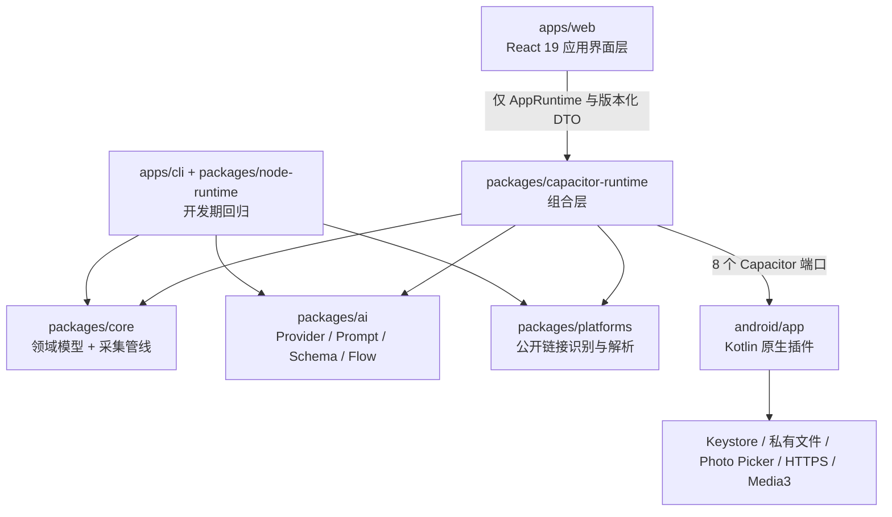

# 项目分析报告

> 分析日期：2026-08-16。基线：`main` HEAD `47b7b2d`，Android `0.1.12` / `versionCode=20`。
> 本文回答"这个项目是怎么运转的"。规则见 [`AGENTS.md`](../../AGENTS.md)，当前能力见[当前能力与发布状态](../当前能力与发布状态.md)，问题清单见[全项目审查报告](2026-08-16-全项目审查报告.md)。

## 一、这是一个什么形态的系统

它是一个**本地优先的 Android APK**，不是 Web 前后端系统。这句话决定了后面所有的架构选择：

- 没有服务端。没有登录、没有账号体系、没有云数据库、没有后台任务队列。
- React 不是"前端"，是**应用界面层**——它跑在 APK 内嵌的 WebView 里，不通过网络访问任何自有服务。
- 共享 TypeScript 不是"BFF"，是**本地应用逻辑层**——采集管线、AI Flow、平台解析全部在设备上执行。
- Kotlin 不是"后端"，是**平台运行时与原生能力层**——只做 Keystore、私有文件、系统媒体选择、受控网络和媒体编解码。
- 用户的 API Key 直接进 Android Keystore，AI 请求由原生层直接打给供应商（小米 MiMo / 阶跃星辰 / 任意 OpenAI 兼容端点）。项目方看不到任何用户数据。

`apps/cli` 与 `packages/node-runtime` 是**开发期回归入口**，用桌面 Node + FFmpeg + sharp 复现同一套共享逻辑，方便在没有设备的情况下验证。它们不进入 APK，这一点由 `tests/apk-runtime-boundary.test.ts` 守着。

## 二、分层与数据流



三条硬边界：

1. `core`、`ai`、`platforms` 不导入 Node、浏览器、Capacitor 或 Android API。它们是纯 TypeScript，同一份代码在 WebView 和 Node 里都能跑。
2. Kotlin 不做业务决策。它接收已经通过校验的指令，执行 I/O，回传稳定的错误码。
3. 页面只认 `AppRuntime` 接口和版本化 DTO。它读不到私有路径、原始平台响应、Cookie、请求头或 API Key。

组合层是唯一知道"共享逻辑"和"原生能力"同时存在的地方。它的职责是把 `HttpClient`、`MediaDownloader`、`MediaTools`、`ArtifactStore` 这些端口接口，用 Capacitor 插件实现出来，然后喂给共享的 `IngestPipeline` 和 AI Flow。

## 三、七阶段采集管线

`packages/core/src/pipeline.ts` 的 `IngestPipeline` 是采集的唯一执行者。阶段定义在 `packages/core/src/models.ts` 第 52–64 行：

| # | 阶段 | 公网链接路径 | 本地视频路径 |
| --- | --- | --- | --- |
| 1 | `detect-platform` | `normalizeInput` 识别链接 + 按平台名取适配器 | 直接完成，标记"本地上传" |
| 2 | `resolve-link` | `adapter.resolve` 跟随跳转拿到最终页 | 空操作成功 |
| 3 | `parse-content` | `adapter.parse` 提取标题、作者、媒体源 | 写入本地文件元数据 |
| 4 | `select-media` | 选最佳视频/音频轨，或图片列表 | 确认已复制的文件 |
| 5 | `download-media` | HTTP 下载（必要时音视频合并） | 空操作"无需网络下载" |
| 6 | `obtain-transcript` | ASR 转写；失败回退描述文本；图文帖走正文 | 同一 ASR 路径 |
| 7 | `save-artifacts` | 写 `task.json` + 终态事件 | 同上 |

每个阶段的状态是 `pending / running / succeeded / degraded / failed`。任务整体状态是 `queued / running / succeeded / degraded / failed / cancelled / interrupted`，其中管线本身只写 `running` 和三个终态，`cancelled` 与 `interrupted` 由运行时层负责。

进度事件带单调递增的 `sequence`，**先落盘再通知页面**。页面的七阶段进度条读的是真实事件里的 `progress` 字段，不是定时器。

首版明确不提供"停止"。`TaskService.cancel` 存在，但运行时实现固定抛 `TASK_CANCEL_FAILED`，页面也不显示停止按钮。

## 四、三条 AI Flow

`packages/ai` 是纯 TypeScript 包，只依赖 `@hongtai/core` 和 `zod`。它的核心设计是：**一次流式生成 + 最多一次纯文本格式修复 + 三层校验**。

### 三层校验

1. **传输层提示**：如果供应商支持，下发 `response_format.json_schema`；否则退到 `json_object`；再否则只靠 Prompt。这只是提示，不是保证。
2. **运行期契约**：`parseStructuredOutput` 做 `JSON.parse` + Zod `safeParse`。失败抛 `AI_STRUCTURED_OUTPUT_INVALID`，绝不补字段。
3. **业务语义校验**：Flow 传入 `validate` 回调，检查证据 ID 是否存在、镜头时长是否相加等于总时长、医疗组装是否合规等。

三层都过了才算数。这是"不伪造生成"这条规则在代码上的落点。

### 渐进式展示的机制

流式响应里，`TopLevelJsonFieldStream` 只在一个顶层 JSON 值**完整闭合**时才发出——它从不猜测半截 JSON。闭合后立刻跑该字段的 Zod 与语义校验，通过了才发 `structured-generation-progress.v1` 快照给页面。

所以用户看到的"五个板块依次渐显"，每一个都是已经校验过的完整结果，不是流式文本的视觉效果。

推理文本（`reasoning_delta`）走另一条路：`ReasoningProgress` 按约 48 字符或 250 毫秒合并，作为 `thinking` 放进同一个进度 DTO。**它只存在于当前运行内存**，不写日志、不入库、不进追问上下文。

### 三条 Flow 的差异

| Flow | 文件 | 是否流式 | 紧凑响应键 | 展示板块 | 产出文档 |
| --- | --- | --- | --- | --- | --- |
| 内容拆解 | `flows/content-analysis/content-analysis-flow.ts` | 是 | 5 个 | 5 个（一一对应） | `content-analysis.v1` |
| 图片观察 | `flows/diagnosis/diagnosis-flow.ts` | 是 | 8 个 | 5 个（按字段组组装） | `diagnosis-report.v1` |
| 视频规划 | `flows/production/production-planning-flow.ts` | **否** | — | 无进度 DTO | `production-plan.v2` |

视频规划不在流式总线上（`StructuredGenerationFlow` 只有 `"diagnosis-report" | "content-analysis"`），它是一次生成 + 一次修复，进度由 Android 侧的渲染事件提供。

另有 `flows/production/avatar-caption-plan.ts` 的 `createAvatarCaptionPlan`：数字人口播模式下按用户口播稿**确定性地**生成字幕计划，不调用模型。

### 医疗边界的实现方式

这是项目风险最高的地方，实现是三层叠加：

1. **Prompt 层**：`prompts/diagnosis-common.ts` 的 `DIAGNOSIS_SAFETY_RULES` 被前置到生成、修复、追问三处，明确禁止疾病诊断、患病概率、处方、药物或保健品推荐、确定性医学结论和整体健康评分。独立的 Markdown 知识库 `knowledge/five-organs-observation.md` 重复了这些禁令。
2. **Schema 层**：`diagnosis-report.v1` **根本没有**健康评分、处方或概率字段；`notADiagnosis` 是 `z.literal(true)`；传统观察参考的每条 `statement` 必须匹配 `/(可能|有时|不确定)/`。
3. **组装层**：`diagnosisSections` 强制 `certainty: "uncertain"`、追加"单张图片不能据此诊断"、覆盖固定免责声明，并把 `safetyGuidance.level` 限定在 `none` / `routine_attention`。图片不可用时不允许携带观察与建议。

需要清楚知道的边界：这套机制是**结构性收紧**，不是内容级禁令扫描。自由文本字段只受长度约束，追问对话是纯文本、无 Schema。详见审查报告。

## 五、八个原生端口

TypeScript 侧在 `packages/capacitor-runtime/src/standalone-bridge.ts` 第 269–279 行注册插件名，Kotlin 侧在 `MainActivity.kt` 第 22–29 行注册实现类。

| 插件名 | Kotlin 类 | 职责 | 主要方法 |
| --- | --- | --- | --- |
| `SecureSettings` | `SecureSettingsPlugin` | Keystore 密钥（**只写不读**） | `writeSecret` / `hasSecret` / `removeSecret` |
| `DeviceSettings` | `DeviceSettingsPlugin` | 应用身份 | `getAppInfo` |
| `LocalData` | `LocalDataPlugin` | 档案与公开 AI 连接配置 | `getProfile` / `saveProfile` / `getAiConnection` / `saveAiConnection` / `compareAndSetAiProbeResults` |
| `LocalFiles` | `LocalFilesPlugin` | 任务/观察/制作/模板的私有文件读写 | 26 个方法，按四类资源分组 |
| `NativeNetwork` | `NativeNetworkPlugin` | 受控 HTTPS | `fetchText` / `download` / `startAiRequest` + `downloadProgress`、`aiRequestEvent` 监听 |
| `FileMedia` | `FileMediaPlugin` | 系统媒体选择 | `pickPhoto` / `capturePhoto` / `pickVideo` / `consumePhotoOperation` / `copyFromUri` |
| `MediaRuntime` | `MediaRuntimePlugin` | 媒体探测与转码 | `probe` / `extractPcmWav` / `segmentPcmWav` / `remuxVideo` |
| `ProductionRuntime` | `ProductionRuntimePlugin` | 成片制作 | `pickAssets` / `render` / `probeTts` + `productionProgress` 监听 |

`SecureSettings` 只写不读是刻意的：API Key 写进 Keystore 后，TypeScript 侧永远拿不回来。AI 请求由 `NativeAiRequestClient` 在原生层解密并附加 `Authorization` 头，`CapacitorAiTransport` 主动拒绝任何 `authorization`、cookie、api-key 请求头透传。

## 六、状态与并发模型

每个 `taskId` / `sessionId` / `projectId` 有且只有一个权威状态源，就是私有目录里的 JSON 文件。规则是**先落盘、后通知**。

并发保护分三层：

- 运行时服务用 `#active` 映射做单航班，同一 ID 的重复 `start()` 复用同一个 Promise。
- `RuntimeOperationRegistry` 登记未完成的工作，供恢复流程查询。
- `StandaloneRuntimeRecovery` 在应用启动时汇总各 owner 的 `inspect` / `recover`，把因进程重建而失联的任务推入幂等的中断恢复。

页面侧的自动更新用窄订阅，不做固定轮询。初始的异步列表读取会通过 `LiveListReadReconciler` 回放读取期间到达的 upsert / delete / 报告终态，并拒绝更早请求的迟到结果。`useAppResume` 在应用从后台返回时重跑加载器。

系统媒体选择被视为**受控外部 Activity**：正常返回时只关闭对应登记、继续原 WebView，不触发全局恢复；只有进程确实重建或执行失联时才进入中断恢复。这条区分是 v0.1.6 端测否决后专门做的。

## 七、测试与门禁现状

**测试运行器**是 Node 内置的 `node:test`，通过 `tsx --test` 运行。没有 Jest 或 Vitest。

```
pnpm check = pnpm -r typecheck && eslint . && tsx --test tests/*.test.ts
```

| 位置 | 文件数 | 用例数 | 当前结果 | 是否进 `pnpm check` |
| --- | --- | --- | --- | --- |
| `tests/*.test.ts` | 53 | 284 | 284 通过 | 是 |
| `packages/capacitor-runtime/src/*.test.ts` | 11 | 67 | **62 通过 / 5 失败** | **否** |
| `android/app/src/test`（JVM 单测） | 17 类 | — | 未在本轮执行 | 否（Gradle） |
| `android/app/src/androidTest`（instrumentation） | 2 类 | — | 需设备 | 否（需模拟器/设备） |

根测试套件的构成值得注意：它不只测业务逻辑，还有相当比例是**契约与边界的静态断言**——比如 `apk-runtime-boundary.test.ts` 断言 APK 入口不导入 node-runtime，`ai-architecture.test.ts` 断言 `packages/ai` 保持纯 TS，`android-plugin-boundary.test.ts` 断言插件白名单与权限，`android-release-archive.test.ts` 断言归档命名与不覆盖。这是这个项目把架构规则工具化的主要手段。

Android 侧的单测全部是**纯策略与解析器**测试（路径策略、网络策略、格式探测、计划解析、WAV 编码），不覆盖插件、Keystore、Photo Picker 或 MediaCodec。真实设备行为靠 instrumentation：HEIF 在 API 24/25 的 fallback、Photo Picker 导入的尺寸与残留、以及 Media3 真实生成 15 秒 720×1280 H.264/AAC 成片。

**门禁缺口**（详见审查报告 M9、N4）：capacitor-runtime 的 67 个并发与恢复用例不在统一检查内，其中 5 个当前是失败的——测试桩仍停留在 v0.1.12 之前的 `diagnosis_single_response` 版本，没人收到信号。此外 ESLint 的 Node 导入禁令不覆盖 capacitor-runtime；`android/**` 被 ESLint 忽略；仓库没有 CI（`.github` 为空），全部检查靠本地执行。

## 八、依赖构成

刻意保持得非常薄。生产依赖总数是个位数。

| 包 | 生产依赖 | 说明 |
| --- | --- | --- |
| `@hongtai/core` | 无 | 纯类型与逻辑 |
| `@hongtai/platforms` | `@hongtai/core` | — |
| `@hongtai/ai` | `@hongtai/core`、`zod ^4` | Zod 是正式文档的唯一业务契约 |
| `@hongtai/capacitor-runtime` | 上述三个 | 无 Capacitor 依赖，`registerPlugin` 由 web 注入 |
| `@hongtai/web` | `@capacitor/*` 8.0.0、`motion` 12.43.0、`react` 19 | 见下节 |
| `@hongtai/node-runtime` | `sharp 0.35.3`（精确锁定）、`undici ^8.10.0` | 仅开发回归 |
| `@hongtai/cli` | node-runtime + 三个共享包 | 仅开发回归 |

Android 侧同样克制：Media3 1.10.1（common / effect / transformer）、`androidx.core-ktx`、`androidx.appcompat`，加上为 API 24/25 HEIF 兼容而固定版本编译的 libheif 1.23.1 与 libde265 1.1.1（仅解码器，16 KiB 页对齐）。**没有引入 kotlinx-coroutines**，并发用的是命名 `Executor`；**没有引入 androidx.security-crypto**，Keystore AES-GCM 是手写的。

`sharp` 是唯一的 Node 原生依赖，只存在于 `node-runtime`，锁文件确认它不出现在其他任何包的依赖树里。

## 九、技术债分布

按层看债务密度：

| 层 | 债务密度 | 主要形态 |
| --- | --- | --- |
| `packages/core` | 低 | 状态机跳过阶段不发终态；原始响应落盘 |
| `packages/platforms` | 中 | 抖音图文帖未解析；主机判定与 `input.ts` 不一致；三份 HTTP 状态映射重复 |
| `packages/ai` | 中 | 自由文本无内容校验；`diagnosis-flow.ts` 一个文件三件事；无请求中止 |
| `packages/capacitor-runtime` | 中 | 五个文件超 460 行；改写 Prompt 越界；单测不进门禁 |
| `packages/node-runtime` | 中高 | 就地写文件、失败删既有产物、FFmpeg 无超时 |
| `apps/web` | 中 | 多处订阅无请求代次令牌；常驻刷新按钮；fixture 页面仍在树里 |
| `android/app` | 中 | 中文文案与 Prompt 越界；业务规则重复实现；两个选择器无进程重建恢复 |
| 文档 | 高（本次已大幅收敛） | 版本、能力表、错误码表、对接清单四处系统性漂移 |

一个跨层的模式值得单独指出：**同一件事在 APK 路径和 CLI 路径上有两份实现，并且已经分叉**。文稿改写 Prompt 是一例（组合层一行 vs node-runtime 四条规则），转写状态汇总是另一例（组合层内联判断 vs `core` 的 `summarizeTranscription`），产物目录布局是第三例（`events.jsonl` / `video-source.bin` vs `task.log` / `video-only.m4s`）。这类分叉会让"CLI 回归通过"逐渐失去对 APK 行为的代表性。

## 十、给新接手者的三条提醒

1. **版本号只有一个来源**：`android/app/build.gradle.kts`。脚本从那里读，文档只能引用。本次审查发现的最严重问题恰恰是文档和测试各自维护了第二份副本，然后漂移了。
2. **"能编译"不等于"能发布"**。这个项目把发布门禁拆得很细：主机构建、模拟器覆盖升级、真实 Provider、物理设备、公网哈希回验是五件不同的事，文档里对它们的表述一直是分开的。不要合并表述。
3. **改动前先判定归属层**。同一个需求，放在页面、组合层还是 Kotlin，结果差别很大。本次审查里几乎所有的架构违规，都是"在离手边最近的那一层顺手实现了"造成的。
