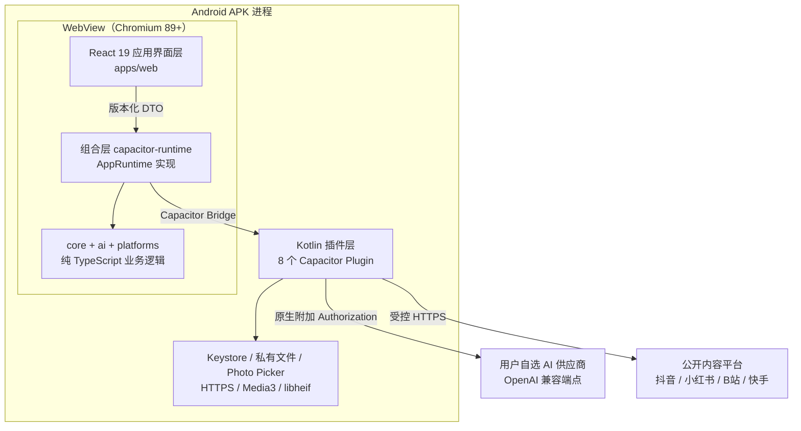

# 宏泰 AI 智能体：项目讲解

> 面向"我要对这个项目有掌控感"的通读文档。写于 2026-08-16，基线 `0.1.12` / `versionCode=20`。
> 这份文档解释**项目是什么、由什么组成、每个文件是干嘛的**。规则见 [`AGENTS.md`](../../AGENTS.md)，当前能做什么见[当前能力与发布状态](../当前能力与发布状态.md)，运转机制见[项目分析报告](2026-08-16-项目分析报告.md)。

---

## 一、项目定位

**给大健康门店老板用的、本地优先的 Android AI 应用。**

拆开说四件事：

**用户是谁**——开线下门店的老板，不是开发者，不是内容团队。他们要做短视频获客，但没有内容能力，也没有剪辑能力。

**解决什么**——三件具体的事：
1. 看到一条别人的爆款视频，想知道"它为什么火、我能怎么抄结构"→ 粘贴公开链接，自动采集并拆解成五个板块（整体概览、钩子驱动、结构主张、风格模板、风险边界），每一条都带原文证据。
2. 有一张顾客的舌象或面部照片，想给一点日常调理方向 → 生成结构化的**日常观察参考**，可以追问。这不是诊断，产品从 Prompt 到 Schema 到组装层都在强制这一点。
3. 手上有素材，想出一条成片 → 基于正式拆解导入本机图片/视频，AI 出镜头计划，设备本地合成竖屏 MP4。

**为什么是"本地优先"**——这是产品定位，也是信任前提。项目没有服务器，用户的照片、视频、门店信息全部留在设备私有目录，API Key 只进 Android Keystore。用户自己填自己的 AI 供应商密钥，请求由设备直接发给供应商，项目方看不到任何数据。这同时也意味着：没有账号、没有云同步、没有跨设备。

**交付形态**——一个独立签名的 Android APK。不是网站，不是小程序，也没有配套后端。

**明确不做的**：疾病诊断、处方、患病概率、健康评分；绕过平台风控或登录墙的采集；批量抓取；伪造的上传、进度、发布结果。

---

## 二、整体基础规范（概括）

用六句话概括这个项目的执行纪律：

1. **分层不可越界**：`core`、`ai`、`platforms` 三个共享包不导入 Node、浏览器、Capacitor 或 Android API；Kotlin 只做系统 I/O，不决定业务流程、UI 文案或医疗规则；页面只用 `AppRuntime` 和版本化 DTO，读不到私有路径、原始响应或密钥。
2. **逻辑只有一份**：Pipeline、状态机、平台解析、Prompt、Schema 不得在 Capacitor 或 Kotlin 里复制第二份。
3. **不许假**：不伪造上传、进度、诊察、生成或发布；fixture 不能当真实结果；"构建成功"不等于"真机通过"。
4. **不泄密**：API Key、Cookie、Token、签名 URL、base64 媒体、供应商推理文本都不进代码、日志、测试快照、Git 或持久化文件。推理文本可以在运行期界面显示，但只活在内存里。
5. **状态必须有终态**：每个 `taskId` 只有一个权威状态源，先落盘再通知；外部 Activity、进程重建、失败、取消都必须走到明确终态，不许永久"进行中"；文件先写临时位置再替换，失败不删已有成功产物。
6. **只有 Release 交付**：不构建、不交付、不归档 Debug APK；版本号的唯一来源是 `android/app/build.gradle.kts`，脚本和文档只能引用；构建产物按版本归档且不覆盖。

另外几条工程习惯：一个文件一个职责（约 300 行是拆分的信号而非硬上限）；共享抽象至少要有两个真实调用点；UI 只按稳定的 `TaskIssue.code` 和 `action` 分支，不解析中文异常或 HTTP 文案；全仓 UTF-8。

---

## 三、项目包含的模块

七个 workspace 包 + 一个 Android 工程。

| 模块 | 路径 | 语言 | 职责 | 进 APK？ |
| --- | --- | --- | --- | --- |
| 应用界面层 | `apps/web` | TypeScript + React | 全部页面、路由、样式、交互 | 是 |
| 领域核心 | `packages/core` | TypeScript | 领域模型、任务契约、七阶段采集管线、错误码 | 是 |
| AI 能力层 | `packages/ai` | TypeScript | Provider、Prompt、Zod Schema、三条 Flow、结构化输出 | 是 |
| 平台解析 | `packages/platforms` | TypeScript | 四个平台的公开链接识别、跳转解析、内容提取 | 是 |
| 组合层 | `packages/capacitor-runtime` | TypeScript | 把共享 Flow 与 Android I/O 端口组装成 `AppRuntime` | 是 |
| 原生层 | `android/app` | Kotlin + C++ | Keystore、私有文件、Photo Picker、受控 HTTPS、Media3、HEIF 兼容 | 是 |
| Node I/O | `packages/node-runtime` | TypeScript | 桌面端的 HTTP、下载、FFmpeg、sharp、文件存储 | **否** |
| CLI | `apps/cli` | TypeScript | 开发期回归命令 | **否** |

最后两个是开发工具。它们让你不用装模拟器就能跑完整的采集与拆解链路，但它们不是 APK 的运行依赖——有专门的测试守着这条边界。

`packages/core` 与 `packages/platforms` 的分工值得单独说：`platforms` **只做识别与解析**，它拿到注入的 `HttpClient` 去取页面、提取媒体地址，然后就结束了。下载、转写、落盘全部由 `core` 的管线负责。这样加一个新平台只需要写一个适配器。

---

## 四、使用的组件库

**结论：几乎没有第三方 UI 依赖。**

界面层的完整依赖只有四项：

| 类别 | 实际使用 |
| --- | --- |
| UI 框架 | React 19 + ReactDOM 19 |
| 动效 | `motion` 12.43.0（即原 Framer Motion 的独立包），用于底部导航、路由转场、顶部通知 |
| 原生桥 | `@capacitor/core` + `@capacitor/app` 8.0.0，**只在 `main.tsx` 里出现** |
| 构建 | Vite 6 + `@vitejs/plugin-react`，目标 `chrome89` |

以下常见的东西**没有**，是刻意的：

- **没有路由库**。用 `history.pushState` + `popstate` 手写，实现在 `apps/web/src/router.ts` 与 `hooks/useBrowserRoute.ts`。
- **没有状态管理库**。没有 Redux / Zustand / Jotai，也没有为业务数据建 Context。每个页面用自己的 `useState`，数据来自 `AppRuntime` 的订阅。
- **没有 CSS 框架**。没有 Tailwind、没有 CSS Modules、没有 styled-components。用的是原生 CSS + `@layer` 级联层 + CSS 变量 token，全部在 `apps/web/src/styles/` 下。
- **没有图标库**。没有 Lucide、没有 Material Icons。图标是手写的 SVG path，集中在 `apps/web/src/components/Icon.tsx`。
- **没有 UI 套件**。没有 Radix、antd、shadcn、MUI。`GlassCard`、`Button`、`Tabs`、`StatePanels` 这些都是自己写的。

字体是本地打包的 `NotoSansSC-VF.woff2`，不走 Google Fonts（有测试断言不出现 Google 资源 URL）。

其他层的依赖同样克制：AI 层只有 `zod`；`core` 和 `platforms` 零生产依赖；Android 侧是 Media3 1.10.1 + androidx 基础库，**没有引入协程库**（并发用命名 `Executor`），**没有引入 security-crypto**（Keystore AES-GCM 手写）。`sharp` 是唯一的 Node 原生依赖，被精确锁定在 0.35.3 且只存在于 `node-runtime`。

---

## 五、整体架构与语言栈

### 语言

| 语言 | 用在哪 | 规模 |
| --- | --- | --- |
| TypeScript | 界面层 + 五个共享包 + CLI | 主体，约 200 个源文件 |
| Kotlin | Android 插件与原生能力 | 40 个文件 |
| C++ | API 24/25 的 HEIF 解码 JNI | 1 个 `.cpp` + CMake |
| PowerShell | 构建、签名、归档、依赖拉取脚本 | 7 个 `.ps1` + 1 个 `.psm1` |
| CSS | 界面样式 | 15 个文件，纯原生 |

### 运行时形态



关键在于：**业务逻辑跑在 WebView 里的 TypeScript**，Kotlin 只在需要触碰系统能力时被调用。AI 请求由 Kotlin 发出（因为密钥在 Keystore 里，TypeScript 拿不到），但请求内容、Schema 校验、重试策略全部由 TypeScript 决定。

### 构建与交付

```
pnpm --filter @hongtai/web build        →  apps/web/dist
npx cap sync android                    →  dist 拷进 android/app/src/main/assets
gradlew :app:assembleRelease            →  签名 APK
scripts/archive-android-release.ps1     →  output/apk-archive/HongTai-AI-Agent-release-v<版本>.apk
```

以上四步被 `scripts/build-android-release.ps1` 串成一条命令，中间还插入了 Release 单测、`lintRelease`、zipalign 校验、v2/v3 签名校验、证书 SHA-256 锚点比对。签名身份强制存在仓库外，脚本会拒绝仓库内的签名配置。

### 环境要求

Node.js 22+（推荐 24）、pnpm 10、JDK 21、Android SDK（compileSdk 36 / minSdk 24 / targetSdk 36）、NDK 28.2.13676358。CLI 媒体回归另需 `ffmpeg` 与 `ffprobe`。

---

## 六、目录结构与文件作用

### 仓库根

| 路径 | 作用 |
| --- | --- |
| `AGENTS.md` | 仓库级执行规则，长期有效。所有任务的第一读物 |
| `README.md` | 项目入口：定位、能力概览、安装、构建、文档导航 |
| `CHANGELOG.md` | 按版本记录用户可见变化 + 版本号递增策略 |
| `download.html` | 对外发布的下载页（手工维护，含各版本 SHA-256 与公网链接） |
| `package.json` | 根脚本：`check` = typecheck + lint + test；`cli` 入口 |
| `pnpm-workspace.yaml` | workspace 成员：`apps/*` + `packages/*` |
| `tsconfig.base.json` | 共享 TS 配置：ES2022、Bundler 解析、`strict`、`noEmit` |
| `eslint.config.js` | ESLint 9 + typescript-eslint；对三个共享包禁用 Node 导入 |
| `capacitor.config.ts` | APK 打包配置：`webDir`、日志关闭、WebView 版本下限、降级页 |
| `.env` / `.env.example` | **仅 CLI 开发用**的供应商配置；`.env` 已 gitignore |
| `.gitignore` | 忽略 `.env`、workspace 数据、Android 构建与签名产物、归档 APK |

### `apps/web` — 应用界面层

```
apps/web/
├── index.html            WebView 入口 HTML
├── vite.config.ts        Vite 配置，target chrome89，dev 绑定 127.0.0.1
├── public/
│   ├── brand/            应用图标与 Pulse Flow 品牌标记
│   ├── fonts/            本地 Noto Sans SC 可变字体 + OFL 许可
│   ├── media/            fixture 页面用的示意图片
│   ├── materials/        富迪素材库离线宣传图
│   └── unsupported-webview.html   WebView 版本过低的中文降级页
└── src/
```

`src/` 的十一个目录：

**根三件**
| 文件 | 作用 |
| --- | --- |
| `main.tsx` | **组合根**：注册原生插件、创建 `AppRuntime`、跑中断恢复、装生命周期协调器、挂载 React。全项目唯一出现 `Capacitor` 与 `registerPlugin` 的地方 |
| `App.tsx` | 路由分发：优先渲染运行时页面；只有传入 `visualData` 时才走 fixture 页面 |
| `router.ts` | 路径匹配器、路径构造器、转场方向。没有路由库 |

**`components/` — 26 个通用组件**
| 文件 | 作用 |
| --- | --- |
| `AppShell.tsx` | 页面外壳：头部、标题、返回、滚动态、内页导航 |
| `BottomNav.tsx` | 五个主标签 + 富迪素材库离线弹窗；导出 `activeNavForRoute` |
| `BrandLogo.tsx` | 头部品牌标记 |
| `Buttons.tsx` | `Button`（`LinkButton` 无调用点） |
| `GlassCard.tsx` | 卡片容器；可点击卡片自动带 `role="button"` 与键盘响应 |
| `Headings.tsx` | `PageHeading` / `SectionHeading` |
| `Icon.tsx` | 内置 SVG 图标集 |
| `Tabs.tsx` | 可访问的 tablist（fixture 页面用） |
| `StatePanels.tsx` | 空态 / 加载 / 错误三种面板 |
| `StatusBadge.tsx` / `TaskStatusBadge.tsx` | fixture 状态标 / 运行时任务状态标 |
| `ProgressSteps.tsx` / `TaskProgressSteps.tsx` | fixture 步骤条 / 真实七阶段步骤条（含事件百分比） |
| `ContentBlocks.tsx` | fixture 用的标签、列表、指标块 |
| `ContentAnalysisDocument.tsx` | 正式 `content-analysis.v1` 的展示与证据渲染 |
| `DeepThinkingPanel.tsx` | 可折叠的运行期"深度思考"面板 |
| `ValidatedModuleProgress.tsx` | 五个已校验板块的渐显进度 + 深度思考 |
| `IssueNotice.tsx` | **错误呈现统一层**：按 `TaskIssue.action` 分支，转成顶部通知 |
| `TopNotification.tsx` | 定时、可滑动关闭的顶部通知 |
| `MediaFrame.tsx` / `RuntimeMediaFrame.tsx` | fixture 图框 / 运行时安全媒体框（img/video/audio） |
| `ProductionProjectCard.tsx` | 单个制作项目卡：素材、镜头、渲染进度、删除 |
| `RouteTransition.tsx` | 路由进出场动效 |
| `SwipeRouteViewport.tsx` | 左右滑动切标签的轨道容器 |
| `FeatureUnavailablePanel.tsx` / `TaskCapabilityNotice.tsx` | 诚实的"尚未接入"提示 |

**`pages/` — 19 个页面**

运行时页面（生产路径实际使用的 13 个）：
| 文件 | 作用 |
| --- | --- |
| `TaskHomePage.tsx` | 首页：粘贴链接检查、创建并启动任务、导入本地视频、历史列表 |
| `TaskProcessingPage.tsx` | 七阶段实时进度 |
| `TaskDetailPage.tsx` | 任务详情：媒体、文稿、确认拆解、删除 |
| `TaskAnalysisPage.tsx` | 正式拆解文档 + 生成流 |
| `ObservationStartPage.tsx` | 观察入口：选模式、选图或拍照、历史会话 |
| `ObservationReportPage.tsx` | 观察报告、五板块、追问 |
| `CreatePage.tsx` | 视频制作工作台（无运行时时降级为 planned 说明） |
| `TemplatesPage.tsx` | 模板列表 / 导入 / 编辑 / 删除 |
| `PublishPage.tsx` | 发布页，全部禁用的 planned 状态 |
| `SettingsPage.tsx` | 设置总入口 |
| `ProfileSettingsPage.tsx` | 本地档案与头像 |
| `AiSettingsPage.tsx` | AI 连接配置、只写不读的密钥、四类能力探测 |
| `ApplicationInfoPage.tsx` | 应用信息与更新记录 |

fixture 页面（设计稿遗留，正式路由不可达）：`HomePage.tsx`、`ProcessingPage.tsx`、`AnalysisResultPage.tsx`、`DetailPage.tsx`、`VitalityScanPage.tsx`、`VitalityResultPage.tsx`。

**其余目录**
| 路径 | 作用 |
| --- | --- |
| `features/tasks/task-presenters.ts` | 七阶段呈现投影 + 拆解文档读取 |
| `features/tasks/content-analysis-module-progress.ts` | 拆解五板块的呈现器 |
| `features/diagnosis/diagnosis-presenters.ts` | `diagnosis-report.v1` 的严格白名单投影 |
| `features/diagnosis/diagnosis-module-progress.ts` | 观察五板块的呈现器 |
| `features/generation/live-list-read-reconciler.ts` | **列表读取与订阅的竞态协调器**：回放读取期间到达的事件，拒绝迟到结果 |
| `features/generation/validated-module-progress.ts` | 从进度 DTO 构造板块行 |
| `hooks/useAppResume.ts` | 应用从后台返回时重跑加载器 |
| `hooks/useBrowserRoute.ts` | pushState / popstate 导航 |
| `hooks/useSwipeNavigation.ts` | 横向滑动切换相邻标签 |
| `hooks/useScrollMotion.ts` | 头部滚动态 |
| `hooks/useInteractionFeedback.ts` | 点击音效 + 振动 |
| `navigation/primary-nav.ts` | 五个主标签定义与相邻计算 |
| `notifications/NotificationProvider.tsx` | 单条当前通知的 Context |
| `notifications/notification-model.ts` | 通知 DTO 与关闭计算 |
| `notifications/notification-countdown.ts` | 可暂停的自动关闭计时器 |
| `runtime/app-lifecycle.ts` | inactive→active 边沿触发 `hongtai:app-resumed` |
| `services/interaction-feedback.ts` | Web Audio 提示音 + `navigator.vibrate` |
| `motion/tokens.ts` | 动效时长、缓动、位移 token |
| `styles/global.css` | 级联层声明与导入总入口 |
| `styles/tokens.css` | 设计 token（颜色、间距、圆角、阴影） |
| `styles/foundation.css` | 重置、字体、body |
| `styles/shell.css` | 应用外壳、头部、滑动轨道 |
| `styles/components.css` | 共享组件样式（最大的一个，约 965 行） |
| `styles/responsive.css` | 断点布局（约 430px / 768px） |
| `styles/pages/*.css` | 八份页面级样式：home、analysis、tasks-runtime、creation、production-runtime、library、settings、observation-runtime、vitality |
| `data/visual-adapter.ts` / `visual-types.ts` / `static-visual-adapter.ts` | fixture 适配器接口、视图模型类型、静态实现（仅测试使用） |
| `data/fixtures/*.ts` | 五份设计稿假数据：home、analysis、creation-library、vitality、media |

### `packages/core` — 领域核心

| 文件 | 作用 |
| --- | --- |
| `index.ts` | 公共导出总汇 |
| `models.ts` | 领域类型：平台、七阶段、任务状态、`ErrorCode` 全表、`TaskIssue`、任务记录 |
| `errors.ts` | `TaskError`、错误到 `TaskIssue` 的映射、`safeUrlForDisplay` 脱敏 |
| `contracts.ts` | I/O 端口接口：`HttpClient`、`PlatformAdapter`、下载器、媒体工具、产物存储、进度上报 |
| `pipeline.ts` | **`IngestPipeline`：七阶段采集的唯一执行者** |
| `input.ts` | `inspectInput` / `normalizeInput`：从分享文案里识别链接 |
| `application-runtime.ts` | `AppRuntime` 全部服务契约、界面 DTO、AI 供应商预设、恢复与能力类型 |
| `runtime-id.ts` | 基于 Web Crypto 的 UUID 形状 ID（兼容旧 WebView） |
| `transcription.ts` | `summarizeTranscription`：ASR 分段汇总 |

### `packages/platforms` — 平台解析

| 文件 | 作用 |
| --- | --- |
| `index.ts` | 构造 `platformRegistry` 并导出适配器 |
| `registry.ts` | 注册表：`find` / `all` / `size` |
| `shared.ts` | UA 常量、类型守卫、`fetchPage`、HTML 内嵌 JSON 提取、媒体去重与请求头 |
| `douyin/adapter.ts` | 抖音：匹配、跳转解析、从 `_ROUTER_DATA` 提取 |
| `xiaohongshu/adapter.ts` | 小红书：从 `__INITIAL_STATE__` 提取 H.264 流与图片列表 |
| `bilibili/adapter.ts` | B站：官方 `view` + `playurl` API，DASH 或 `durl` |
| `kuaishou/adapter.ts` / `client.ts` / `parser.ts` | 快手（实验性）：编排、匿名 GraphQL 客户端、仅 MP4 的媒体选择与 `raw` 脱敏 |
| `*/README.md` | 各平台说明（抖音/小红书/B站的三份是过时占位，快手那份是准确的） |

### `packages/ai` — AI 能力层

| 路径 | 作用 |
| --- | --- |
| `index.ts` | 公共导出（**不导出** prompts、knowledge、Node 传输） |
| `node.ts` | CLI 专用工厂：校验 HTTPS 与密钥后组装 Fetch 传输 |
| `contracts/provider.ts` | `AiProvider` / `AiTransport` 契约、流事件、生成与转写请求 |
| `contracts/content-analysis.ts` | 拆解输入、存储端口、运行记录、Flow 依赖 |
| `contracts/diagnosis.ts` | 会话/图片/消息/运行端口、`DiagnosisRepository` |
| `contracts/production-planning.ts` | 制作计划输入、素材、Flow 依赖 |
| `flows/content-analysis/content-analysis-flow.ts` | 内容拆解：流式解析 → 板块进度 → 一次修复 → 保存 `content-analysis.v1` |
| `flows/diagnosis/diagnosis-flow.ts` | 图片观察：报告流、板块组装、追问对话、上下文压缩 |
| `flows/production/production-planning-flow.ts` | 视频规划：一次生成 + 一次修复 + 语义校验 |
| `flows/production/avatar-caption-plan.ts` | 数字人字幕计划：**确定性生成，不调模型** |
| `prompts/content-analysis-common.ts` | 拆解共用规则与证据 JSON 约定 |
| `prompts/content-analysis-single.ts` | 拆解的生成与修复 Prompt |
| `prompts/diagnosis-common.ts` | **医疗安全规则** + 紧凑输出规则 |
| `prompts/diagnosis-report-single.ts` | 观察报告的生成与修复 Prompt（注入知识库） |
| `prompts/diagnosis-conversation.ts` | 追问对话 Prompt |
| `prompts/production-planning.ts` | 制作计划的生成与修复 Prompt |
| `knowledge/five-organs-observation.md` | **传统望诊观察知识库**（权威源，含安全禁令） |
| `knowledge/five-organs-observation.generated.ts` | 构建期生成的字符串嵌入（由脚本产出，勿手改） |
| `schemas/content-analysis.ts` | 紧凑五字段响应 + 正式 `content-analysis.v1` |
| `schemas/diagnosis-report.ts` | 紧凑八字段响应 + 正式 `diagnosis-report.v1` + 板块 Schema |
| `schemas/production-plan.ts` | `production-plan.v1`（只读兼容）+ `v2`（写入） |
| `structured-output/json-schema.ts` | Zod → 供应商 JSON Schema |
| `structured-output/parse-structured-output.ts` | JSON 解析 + Zod 校验，失败抛稳定错误码 |
| `structured-output/generate-structured-module.ts` | 一次生成 + 最多一次纯文本修复 |
| `structured-output/top-level-json-field-stream.ts` | **只在顶层 JSON 值完整闭合时才发出**，从不猜半截 |
| `structured-output/reasoning-progress.ts` | 推理增量的合并 |
| `structured-output/structured-generation-progress.ts` | 构造 `structured-generation-progress.v1` 快照 |
| `providers/openai-compatible-provider.ts` | OpenAI 兼容生成与转写、方言映射、SSE、重试 |
| `transports/fetch-ai-transport.ts` | **Node 侧传输，持有 API Key**（根导出不暴露，APK 不用） |

### `packages/capacitor-runtime` — 组合层

| 文件 | 作用 |
| --- | --- |
| `index.ts` | 公共导出 |
| `standalone-app-runtime.ts` | **组合根**：装配所有 Flow、端口、档案、AI 设置与探测 |
| `standalone-bridge.ts` | 插件 TS 接口定义 + `registerStandaloneNativePlugins` 名称映射 |
| `standalone-task-service.ts` | 文件支撑的 `TaskService`，执行委托给 `IngestPipeline` |
| `standalone-analysis-service.ts` | 拆解服务，运行 `ContentAnalysisFlow` |
| `standalone-diagnosis-service.ts` | 观察服务，运行 `DiagnosisFlow` |
| `standalone-production-service.ts` | 制作服务，运行规划 Flow 与 Media3 渲染 |
| `standalone-template-service.ts` | 模板服务 |
| `standalone-runtime-recovery.ts` | 汇总各 owner 的中断检查与恢复 |
| `runtime-operation-registry.ts` | 内存中的单航班与未完成工作登记 |
| `runtime-interruption.ts` | 共享的 `TASK_INTERRUPTED` 处理 |
| `thin-ingest-ports.ts` | 把原生网络/文件/媒体适配成 core 的三个端口 |
| `thin-task-files.ts` | 逻辑 `task://` 路径与产物存储适配 |
| `native-link-errors.ts` | 原生 `ERR_LINK_*` 到 `TaskError` 的映射 |
| `capacitor-ai-transport.ts` | AI 传输映射到原生（**主动拒绝密钥类请求头**） |
| `*.test.ts`（11 个） | 包内单测：组合、恢复、并发。注意当前不进 `pnpm check` |

### `packages/node-runtime` — 开发期 Node I/O

| 文件 | 作用 |
| --- | --- |
| `index.ts` | 导出汇总 |
| `config.ts` | 读取 `.env` 与 `HONGTAI_*` 环境变量 |
| `errors.ts` | Node 错误（`ENOSPC` / `EACCES` / 超时）到 `TaskError` |
| `http/node-http-client.ts` | 带跳转与重试的 HTTPS 客户端 |
| `download/node-downloader.ts` | 基于 undici `RetryAgent` 的媒体下载 |
| `media/ffmpeg-tools.ts` | 桌面 FFmpeg / FFprobe 实现 |
| `storage/file-artifact-store.ts` | workspace 目录的产物存储 |
| `progress/terminal-reporter.ts` | 七阶段终端进度打印 |
| `transcript/openai-media-client.ts` | Node 侧 ASR 与文稿改写 |
| `ai/sharp-image-preprocessor.ts` | CLI 图片归一化（唯一用 sharp 的地方） |
| `ai/sanitize-ai-artifact.ts` | 打印前脱敏 Bearer / base64 / 疑似密钥 |
| `ai/file-content-analysis-store.ts` | 文件系统的拆解存储 |
| `ai/file-diagnosis-repository.ts` | 文件系统的观察仓储 |
| `ai/diagnosis-harness-server.ts` | `pnpm cli diagnosis serve` 的回环 HTTP 调试台 |

### `apps/cli` — 开发回归命令

| 文件 | 作用 |
| --- | --- |
| `index.ts` | 三个命令：`ingest`、`analyze-content`、`diagnosis serve` |
| `ai-command-options.ts` | 参数解析 |
| `platform-support.ts` | 实验性平台提示文案 |
| `terminal-ai-stream-printer.ts` | 把推理与内容增量打到终端 |

### `android/app` — 原生层

**Kotlin，按目录分组：**

| 目录 | 文件 | 作用 |
| --- | --- | --- |
| 根 | `MainActivity.kt` | `BridgeActivity`；注册 8 个插件；常亮与沉浸式 |
| `bridge/` | 8 个 Plugin + `NativeIssueCode.kt` | Capacitor 插件实现与稳定错误码表 |
| `storage/` | `AndroidKeystoreSecretStore.kt` | Keystore AES-GCM 加密，密文存私有 prefs |
| | `LocalPreferences.kt` / `LocalDataRecords.kt` / `LocalDataPublicMapper.kt` | 公开档案与 AI 元数据；**公开 DTO 白名单，永不含密钥** |
| `network/` | `NativeNetworkPolicy.kt` | HTTPS 强制、内网拒绝、请求头与请求体凭据过滤 |
| | `NativeDownloadClient.kt` / `NativeTextFetchClient.kt` / `NativeAiRequestClient.kt` | 下载、页面抓取、AI 请求（原生附加密钥） |
| | `NativeLinkFailureClassifier.kt` | 失败归类为稳定码，剥离 IP 与异常文本 |
| | `NativeNetworkContracts.kt` | 网络 DTO 与异常 |
| `media/` | `MediaRuntime.kt` / `AndroidMediaRuntime.kt` | 探测、PCM 提取、WAV 分段、remux 的契约与实现 |
| | `PrivateArtifactStore.kt` | 任务根目录的原子写入、读取、删除 |
| | `PrivateMediaStore.kt` | 图片导入与相机 FileProvider 暂存 |
| | `ObservationImageDecoder.kt` / `ObservationImageNormalizer.kt` / `ImageFormatProbe.kt` | 解码器选择、EXIF 与缩放归一化、格式魔数探测 |
| | `PhotoCapturePolicy.kt` / `PhotoOperationStateStore.kt` | 拍照文件名策略；**跨进程重建的照片操作登记** |
| | `TaskVideoImportStore.kt` / `TaskVideoImportPolicy.kt` | 本地 MP4 导入与校验 |
| | `TaskMediaRuntimePolicy.kt` | 任务媒体路径、ASR 分段、remux MIME 策略 |
| | `heif/LegacyHeifDecoder.kt` / `LegacyHeifContracts.kt` | API 24/25 的 HEIF 原生回退 |
| `production/` | `ProductionMediaStore.kt` | 制作素材导入、探测、输出目录 |
| | `ProductionPlanParser.kt` | 解析并二次校验 `production-plan.v1/v2` |
| | `ProductionRenderer.kt` | Media3 Transformer 合成与导出 |
| | `ProductionFailure.kt` | 制作失败类型 |
| | `SystemNarrationSynthesizer.kt` / `CloudNarrationSynthesizer.kt` | 系统离线 TTS / 云端 TTS |

**其他：**

| 路径 | 作用 |
| --- | --- |
| `src/main/cpp/heif/legacy_heif_jni.cpp` | JNI 静态 HEIF 解码：盒校验、libheif HEVC、RGBA Bitmap |
| `src/main/cpp/heif/CMakeLists.txt` | 固定 libde265/libheif 版本，仅解码器，16 KiB 页 |
| `src/main/AndroidManifest.xml` | **只声明 INTERNET**；FileProvider 仅暴露拍照缓存目录 |
| `src/main/res/values/` | 应用名、主题 |
| `src/main/res/xml/` | FileProvider 路径、备份排除规则、Capacitor 生成配置 |
| `src/test/java/` | 17 个 JVM 单测类，全部测纯策略与解析器 |
| `src/androidTest/java/` | 2 个 instrumentation 类：HEIF 回退、真实成片渲染 |
| `build.gradle.kts` | **版本号唯一来源**；签名配置强制仓库外；NDK/CMake；四 ABI |
| `../third_party/heif/` | libheif 与 libde265 的 LGPL 许可、NOTICE 与 SBOM |
| `../native-deps/heif-lock.json` | 原生依赖的版本与哈希锁 |

### `scripts` — 构建与发布

| 文件 | 作用 |
| --- | --- |
| `build-android-release.ps1` | **唯一的 APK 构建入口**：从 Gradle 读版本 → web 构建 → cap sync → Release 单测 → lint → assembleRelease → zipalign/签名/证书校验 → 归档 |
| `archive-android-release.ps1` | 按版本命名归档；同哈希幂等，不同字节直接报错不覆盖 |
| `init-android-release-signing.ps1` | 一次性创建**仓库外**签名身份，拒绝覆盖已有身份 |
| `android-release-signing-transaction.psm1` | 签名目录的暂存与原子发布 |
| `normalize-capacitor-config.ps1` | 规范化生成的 `config.xml` 为 UTF-8 / LF |
| `fetch-android-heif-sources.ps1` | 按锁文件拉取并校验 HEIF 原生源码 |
| `check-environment.ps1` | 打印 Node / pnpm / ffmpeg 环境 |
| `generate-diagnosis-knowledge-module.mjs` | 把知识库 Markdown 生成为 TS 字符串模块 |

### `tests` — 统一检查套件

53 个 `*.test.ts`，284 个用例。大致分四类：

- **业务逻辑**：`pipeline`、`platforms`、`input`、`transcription`、三条 flow、`structured-generation-progress`
- **架构契约断言**：`apk-runtime-boundary`（APK 不得导入 node-runtime）、`ai-architecture`（AI 包保持纯 TS）、`android-plugin-boundary`（插件白名单与权限）、`architecture-minimal-runtime`
- **发布与版本**：`android-version-lineage`、`android-release-archive`、`android-release-signing-*`、`android-webview-compat`、`android-heif-native-*`
- **界面契约**：19 个 `web-*` 测试，覆盖路由、通知、移动端布局、真实性边界、观察与任务运行时

支撑目录：`tests/support/`（签名测试共享 helper）、`tests/fixtures/`（脱敏 fixture 与合成图片）、`tests/smoke/`（人工冒烟说明，无自动化测试）。

### `docs` — 文档体系

| 分组 | 内容 |
| --- | --- |
| 入口 | `文档索引.md` —— 该读哪一份 |
| 活文档 | `当前能力与发布状态.md`、`架构与工程规范.md`、`项目整体架构方向.md`、`AI应用能力层架构.md`、`前端显示板块对接清单.md`、`错误码与前端通知约定.md`、`任务执行模板.md`、`版本与发布流程.md` |
| 操作指南 | `CLI运行与产物说明.md`、`本地端测配置.md`、`Android发布签名与升级指南.md`、`Android旧系统HEIF兼容与依赖指南.md`、`开源项目参考对照.md`、调研与交互验收记录 |
| 历史证据 | `验收/` 下 28 份按日期的验收记录；`apk-debug-verification.md`、`首版CLI完成总结与验证报告.md` |
| 任务与交接 | `任务/` 下的任务契约；`交接/` 下已废弃的交接文档 |
| 审查 | `审查/` —— 本次审查报告、分析报告与本文 |
| 设计与旧计划 | `superpowers/specs/`（11 份设计）、`superpowers/plans/`（15 份实施计划）、`Hong/stitch_ai/`（设计稿 HTML 与截图）、两份前端视觉迁移记录 |

**读文档的优先级**（冲突时）：用户明确要求 → `AGENTS.md` → 活文档的架构与状态契约 → 代码与测试的已验证事实 → 历史验收记录 → 旧计划与设计稿。

### `output` / `workspace` — 本地产物

`output/apk-archive/` 存版本化的 Release APK（不进 Git）；`output/` 下其余是端测截图与证据；`workspace/` 是 CLI 回归的任务产物目录。这两个目录都不参与构建。

---

## 七、快速上手清单

```powershell
pnpm install
pnpm check                              # 类型 + lint + 284 个测试
pnpm --filter @hongtai/web dev          # 开发界面（浏览器里跑，无原生能力）
pnpm --filter @hongtai/web build        # 构建界面产物

pnpm cli ingest "公开视频链接"           # CLI 采集回归
pnpm cli analyze-content "任务ID"        # CLI 拆解回归
pnpm cli diagnosis serve                # 本地观察调试台

.\scripts\init-android-release-signing.ps1   # 首次：创建仓库外签名身份
.\scripts\build-android-release.ps1          # 构建并归档 Release APK
```

改动后按影响范围选验证：TypeScript 至少 `pnpm check` + 定向测试；界面改动加 `pnpm --filter @hongtai/web build` 与约 390px 移动端检查；Android 改动跑相关 Gradle 测试与构建，涉及相册、相机、外部 Activity、网络或 Media3 的必须补真机证据。
