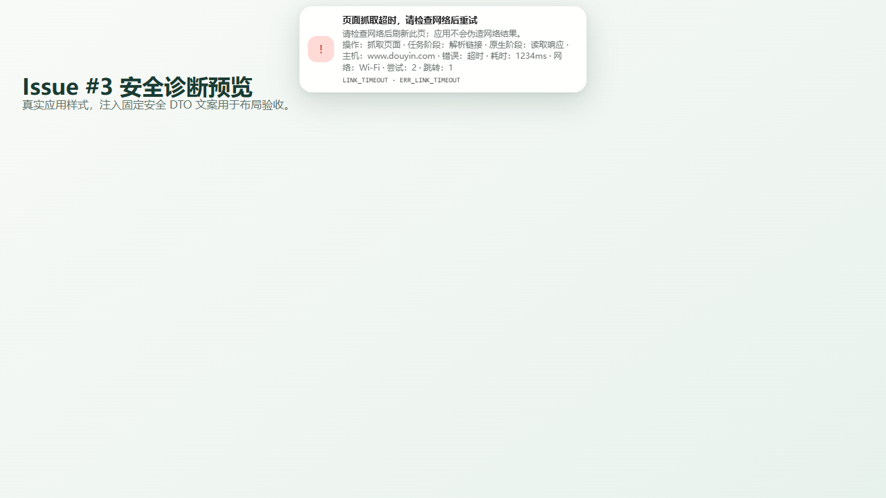
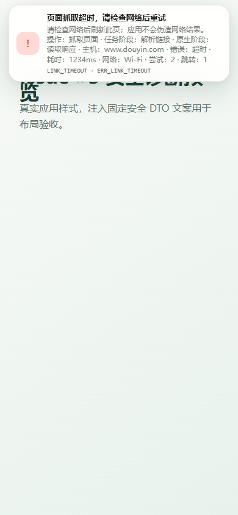

# P0 Issue #3：原生链接失败分类与安全诊断验收

> 日期：2026-08-09
> 范围：GitHub Issue #3；只覆盖链接解析 / 原生网络桥接。
> 结论：源码、JVM 分类器、Capacitor 映射、core 持久化与 Web 展示已验证；真实断网/超时 UI E2E 和物理机网络覆盖留给最终集成任务。

## 任务契约

### 目标

- 用户可感知的结果：链接抓取失败不再全部折叠为“网络错误”；通知可区分网络/超时/跳转/异常响应，同时保留页面结构变化、平台拒绝和无媒体等既有业务语义。

### 允许修改

- Android I/O：`NativeTextFetchClient`、原生网络契约、纯分类器、稳定技术码与 `NativeNetworkPlugin.fetchText`。
- Capacitor Runtime：原生拒绝白名单验证和 `TaskError` 映射。
- core：`NativeLinkDiagnosticV1`、`TaskError`/`TaskIssue` 传播、`resolve-link` 失败持久化去敏。
- UI：`IssueNotice` 安全摘要和通知换行布局。
- 本 Issue 专属测试、错误码活契约、本文与两张布局证据截图。

### 明确不做

- 不处理 Issue #1/#2/#4 或其他 Issue；不修改 README、当前能力状态或架构规范。
- 不放宽 TLS、关闭证书校验、增加自动重试状态机、复制平台解析或新增云端服务。
- 不增加 `ACCESS_NETWORK_STATE` 或其他权限；不采集 SSID、IP、运营商信息。
- 不安装 APK、不操作共享模拟器、不声称物理真机或真实断网 E2E 已通过。

### 架构归属

- Android I/O 只分类系统网络失败并生成安全拒绝数据。
- Capacitor Runtime 是原生 `data` 的唯一白名单验证边界。
- core 的 `IngestPipeline` 继续是七阶段唯一状态权威；失败保留在实际 `TaskStage`。
- React 只消费 `TaskIssue.code/action` 和版本化安全诊断，不解析中文异常、HTTP 原文或 DOM 文案。

### 权威状态与数据

- `taskId` 仍是任务唯一标识；失败任务的 `currentStage`、事件和 `TaskIssue.stage` 必须一致。
- `resolve-link` 失败写为终态 `failed`，不自动恢复、不覆盖旧任务。
- 输入 URL 只在内存中交给平台 adapter；任务记录和日志使用去除 query/hash 的展示 URL。

## DTO 安全字段表

| 字段 | 必需 | 约束 | 展示 |
| --- | --- | --- | --- |
| `schemaVersion` | 是 | 固定 `native-link-diagnostic.v1` | 不单独展示 |
| `operation` | 是 | 固定 `fetch-text` | 抓取页面 |
| `phase` | 是 | `request/connect/redirect/response/decode` | 固定中文标签 |
| `hostname` | 否 | DNS 主机名；IP、URL、query 不接受 | `主机：…` |
| `errorClass` | 是 | 固定十类安全枚举 | DNS/TLS/连接/超时/跳转/响应 |
| `elapsedMs` | 是 | 整数 `0..600000` | 毫秒 |
| `networkType` | 否 | 七个固定枚举；当前 Android 不采集 | 有值才展示 |
| `attempt` | 是 | 整数 `1..3` | 尝试次数 |
| `redirectCount` | 是 | 整数 `0..5` | 已处理跳转数 |

明确禁止：完整 URL、query、Cookie、Authorization、请求体、响应正文、Throwable message/stack、SSID、IP、运营商信息、用户图片/音视频。未知字段不会复制进 `TaskError`、`TaskIssue`、任务 JSON、事件或 UI。

## 错误码与动作契约

| 原生技术码 | `TaskIssue.code` | 动作 | 用户可见区别 |
| --- | --- | --- | --- |
| `ERR_LINK_DNS_FAILED` | `LINK_NETWORK_FAILED` | `check_network` | DNS |
| `ERR_LINK_TLS_FAILED` | `LINK_NETWORK_FAILED` | `check_network` | TLS |
| `ERR_LINK_CONNECTION_FAILED` | `LINK_NETWORK_FAILED` | `check_network` | 连接失败 |
| `ERR_LINK_TIMEOUT` | `LINK_TIMEOUT` | `check_network` | 超时 |
| `ERR_LINK_REDIRECT_LIMIT` | `LINK_REDIRECT_LIMIT` | `edit_input` | 跳转超限 |
| `ERR_LINK_REDIRECT_INVALID` | `LINK_REDIRECT_INVALID` | `edit_input` | 跳转无效 |
| `ERR_LINK_RESPONSE_TOO_LARGE` | `LINK_HTTP_ERROR` | `retry` | 响应过大 |
| `ERR_LINK_RESPONSE_INVALID` | `LINK_HTTP_ERROR` | `retry` | 响应编码无效 |
| `ERR_LINK_RESPONSE_FAILED` | `LINK_NETWORK_FAILED` | `check_network` | 响应读取失败 |
| `ERR_LINK_REQUEST_INVALID` | `LINK_HTTP_ERROR` | `edit_input` | 请求不符合安全限制 |

页面结构变化继续使用 `CONTENT_SCHEMA_CHANGED`；无媒体继续使用 `MEDIA_SOURCE_NOT_FOUND`；登录/私密、平台风控和平台 API 失败继续使用既有业务码。

## 验证边界与证据

### 自动测试与构建

- `pnpm exec tsx --test packages/capacitor-runtime/src/thin-ingest-ports.test.ts tests/pipeline.test.ts tests/platforms.test.ts`：30/30 通过。
- `pnpm check`：类型检查、ESLint、根测试 184/184 通过。
- `pnpm --filter @hongtai/web build`：通过；Vite 转换 611 个模块。现有单 chunk 大于 500 kB 警告未因本 Issue 扩写。
- `:app:testDebugUnitTest`：通过；纯分类器覆盖 DNS、TLS、连接失败、连接/响应超时、跳转、响应过大、无效编码和响应 I/O，并断言无 Throwable cause/敏感字段。
- `:app:assembleDebug`：通过；未安装 APK。
- `:app:lintDebug`：已运行但未通过，报告为 2 errors / 22 warnings。两个 error 均位于本 Issue 未修改的既有代码：`PrivateMediaStore.kt:68` 使用 API 33 `readNBytes`，`MainActivity.kt:27` 缺少 Media3 `UnstableApi` opt-in。lint 报告没有指向 Issue #3 改动文件；按范围约束未顺手修复。

### 持久化与平台语义

- Capacitor rejection `{ code, data }` 的测试覆盖全部 `ERR_LINK_*` 映射，未知字段、IP、原始异常文案被丢弃。
- Pipeline 回归确认失败停在 `resolve-link`；任务记录、事件和失败投影不含输入 query、Cookie、Authorization 或 Throwable 原文。
- 平台 fixture 确认页面结构变化仍为 `CONTENT_SCHEMA_CHANGED`，无媒体仍为 `MEDIA_SOURCE_NOT_FOUND`，不会被网络错误吞掉。

### Web 布局

- 1280×720：安全摘要完整可读，无横向溢出。
- 390×844：通知正文换行，阶段、主机、错误类、耗时、网络、尝试和跳转均可见。
- 该浏览器检查使用真实应用 CSS 与固定安全 DTO 布局 harness；它不是网络 E2E。

## 最终集成：API 35 模拟器 E2E

使用最终集成任务独占的 API 35 AVD，安装同一待验 debug APK 后逐项记录任务 ID、阶段事件、UI 截图和应用私有任务投影：

1. 完全断网：在 `resolve-link` 触发失败，UI 显示 `LINK_NETWORK_FAILED` 与安全诊断；恢复网络后由用户新建任务，旧任务不覆盖。
2. DNS：通过受控 DNS/代理让目标主机解析失败，确认 `ERR_LINK_DNS_FAILED`、`errorClass=dns`，且不显示 DNS 响应或 IP。
3. TLS：通过受控无效证书端点触发握手失败，确认 `ERR_LINK_TLS_FAILED`；不得放宽证书校验。
4. 连接不可达：受控路由拒绝/无路由，确认 `ERR_LINK_CONNECTION_FAILED`。
5. 超时：受控 HTTPS 端点分别延迟响应头和响应体，确认 `ERR_LINK_TIMEOUT`，并区分 `phase=connect/response`。
6. 跳转：覆盖超过 5 次、缺失 `Location`、不安全/无效目标，确认 `ERR_LINK_REDIRECT_LIMIT` 或 `ERR_LINK_REDIRECT_INVALID`。
7. 异常响应：覆盖超过 2 MiB、无效 UTF-8、响应体中断，确认响应限制/读取分类。
8. 平台语义：用批准 fixture/受控响应覆盖页面结构变化、无媒体、平台拒绝，确认仍为既有业务码。
9. 去敏审计：使用带测试 query 的公开链接和测试 header，经 `run-as` 读取 debug 私有任务 JSON/events；搜索确认没有 query、Cookie、Authorization、请求/响应正文和 Throwable 原文。
10. 视口：API 35 模拟器约 390px 宽检查通知换行、可访问性角色与动作按钮；同时保留桌面浏览器截图作 CSS 对照。

## 最终集成：物理机网络覆盖

- 至少两台物理设备或两种厂商网络栈；记录 Android 版本、设备型号和 APK SHA-256。
- Wi-Fi 正常/断开、蜂窝网络正常/弱网、Wi-Fi 与蜂窝切换、IPv6-only/双栈、VPN 开关、受控门户/代理、系统时间错误导致的 TLS 失败。
- 每种失败都核对：实际阶段、技术码、业务码/action、是否可重试、通知摘要、旧任务保留、恢复网络后的手动新任务。
- 当前实现不申请 `ACCESS_NETWORK_STATE`，因此 `networkType` 预期缺省；不得为了补字段在最终集成时临时增加权限。
- 真实平台行为会随页面变化；记录发生时间和平台，不把一次成功外推为长期可用。

## 交付边界

- 本工作树只创建本地 commit；不 push、不关闭 Issue #3。
- 未执行 APK 安装、共享模拟器操作或物理机测试。
- Android lint 的两个既有错误需要在其所属 Issue 独立处理，本 Issue 不修改对应文件。
